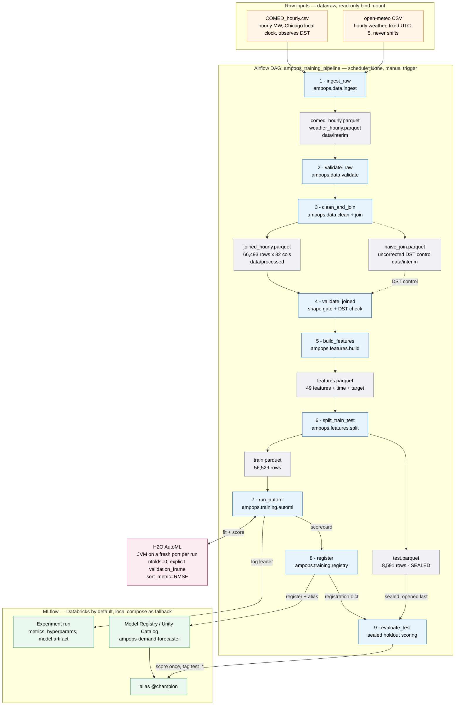
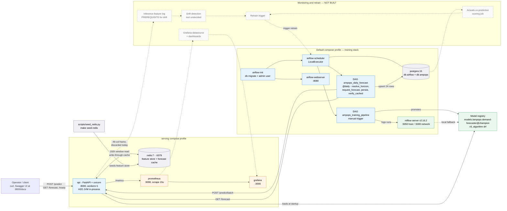
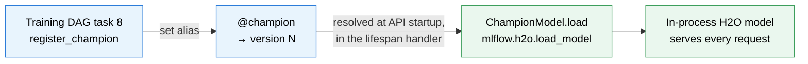

# AmpOps System Architecture

Status: current as of 2026-08-13 (branch `sachin/feature-fastapi`). Two diagrams — the
**training pipeline** and the **deployment/serving topology** — with the supporting
reference tables needed to redraw them in any tool.

**Rendering:** every diagram below is a fenced ```mermaid``` block. Paste the block
contents into [mermaid.live](https://mermaid.live) to render, export SVG/PNG, or edit.
GitHub renders them inline as-is.

> **Maintenance note.** Components drawn with a **dashed border** are designed but not
> yet built (drift detection, actuals scoring, retrain trigger). This document is to be
> updated when that stage lands — the dashed nodes become solid and §7's status table
> moves those rows from *planned* to *implemented*.

---

## 1. The system in one paragraph

AmpOps is a day-ahead electricity demand forecaster for the ComEd zone, built as a
complete MLOps loop rather than a model. Two raw CSVs — seven years of hourly load and
matching weather — are cleaned, timezone-realigned, joined, and turned into 49
leakage-safe features by an Airflow DAG. That DAG runs an H2O AutoML search, promotes the
winner into the MLflow Model Registry under a `@champion` alias, and scores it once
against a sealed 12-month holdout. A FastAPI service loads whatever model currently holds
that alias and serves forecasts, calling **the same feature-engineering functions the
training pipeline used** — the single design decision the whole serving layer is built
around. A second DAG precomputes each operating day's 24 hourly forecasts and records
them in Postgres. Prometheus scrapes the API throughout.

**The architecture's organizing principle:** the model registry is the only contract
between training and serving. Training publishes an alias; serving resolves it. Neither
side knows anything else about the other.

---

## 2. Diagram 1 — Training pipeline

From raw CSVs to a registered, holdout-scored champion. Every box in the middle column is
one Airflow `@task`; every task body is a thin call into the `ampops` package under
`src/`, so the DAG file reads as a picture of the pipeline and the logic stays unit-testable
without a scheduler.



**Reading the diagram:** blue = Airflow task, grey = parquet artifact, green = MLflow,
pink = the H2O JVM, orange = raw input. Artifacts are drawn inline in the chain rather
than grouped by storage location; the volume each lives on is named in the node and
listed in §2.1. Solid arrows carry data or control; the dotted arrow is the DST control
comparison.

### 2.1 Task reference

| # | Task | Calls into | Consumes | Produces | Why it exists |
|---|---|---|---|---|---|
| 1 | `ingest_raw` | `data.ingest.load_comed`, `load_weather_hourly` | 2 raw CSVs | 2 interim parquets | The weather CSV is **two concatenated exports**; ingestion slices out the hourly block only |
| 2 | `validate_raw` | `data.validate.validate_raw_*` | interim parquets | pass/fail | Fail at the boundary, not 6 tasks later |
| 3 | `clean_and_join` | `data.clean`, `data.join` | interim parquets | `joined_hourly.parquet` + `naive_join.parquet` | DST realignment, fall-back dedup, window trim, then the join |
| 4 | `validate_joined` | `data.validate.validate_joined`, `check_dst_alignment` | both joins | pass/fail | Shape gate **66,493 x 32**; compares corrected vs naive join to prove realignment direction |
| 5 | `build_features` | `features.build.build_features` | joined | `features.parquet` | Calendar + cyclical + holiday + horizon-safe lag/rolling features |
| 6 | `split_train_test` | `features.split.time_split` | features | `train.parquet`, `test.parquet` | Chronological split, final **12 months** sealed |
| 7 | `run_automl` | `training.automl.run_h2o_automl` | train path | MLflow run + scorecard dict | The model search. Never opens `test.parquet` |
| 8 | `register` | `training.registry.register_champion` | scorecard dict | registration dict | Promotes to `@champion`; soft-fails to a `runs:/` URI if no usable catalog |
| 9 | `evaluate_test` | `automl.evaluate_on_test` + `registry.tag_test_metrics` | registration dict + test path | test metrics as tags | Scores the holdout **after** promotion, so it can never influence selection |

### 2.2 Three things the diagram is drawing attention to

**Tasks pass file *paths*, never DataFrames.** XCom is backed by the Airflow metadata
database — it is a message channel, not a data transport. Every arrow between tasks in the
diagram carries a string; every arrow to a parquet node carries the actual data.

**`naive_join.parquet` is a deliberate control, not a leftover.** The two sources disagree
about DST — COMED is DST-aware Chicago local time, weather is a fixed UTC-5 grid that never
shifts. `validate_joined` compares the corrected join against the uncorrected one to prove
the realignment went the right direction, rather than assuming it.

**The sealed holdout has its own arrow, arriving late.** `test.parquet` connects only to
task 9, and task 9 runs after registration. That ordering is the entire reason the reported
test metric means anything.

---

## 3. Diagram 2 — Deployment and serving topology

The runtime stack. Two Docker Compose profiles: the **default** profile brings up training
infrastructure; the **`serving`** profile adds the API, Redis, and dashboards, so the
training stack doesn't pay for a JVM and two dashboards it doesn't use.



### 3.1 Service inventory

| Service | Image / build | Host port | Profile | Persistent storage | Role |
|---|---|---|---|---|---|
| `postgres` | `postgres:15` | — | default | `postgres-data` | Airflow metadata DB **and** the `ampops` forecast system of record |
| `mlflow` | `ghcr.io/mlflow/mlflow:v2.16.2` | **5050** | default | `mlflow-data` | Local tracking + artifact server, fallback for Databricks |
| `airflow-init` | `docker/airflow/Dockerfile` | — | default | — | One-shot `db migrate` + admin user |
| `airflow-scheduler` | same | — | default | `ampops-logs` | LocalExecutor; runs both DAGs |
| `airflow-webserver` | same | 8080 | default | `ampops-logs` | DAG UI |
| `api` | root `Dockerfile` | 8000 | `serving` | — | FastAPI + in-process H2O JVM |
| `redis` | `redis:7-alpine` | 6379 | `serving` | `redis-data` | Feature store (read) + forecast cache (write-through) |
| `prometheus` | `prom/prometheus:latest` | 9090 | `serving` | — | Scrapes `api:8000/metrics` every 15s |
| `grafana` | `grafana/grafana:latest` | 3000 | `serving` | `grafana-data` | Dashboards — **runs but ships no provisioned dashboard yet** |

Two port choices worth annotating on a slide: MLflow publishes on **5050, not 5000**,
because macOS AirPlay Receiver owns 5000 — inside the compose network it is still 5000.
And the API runs **exactly one uvicorn worker**, because each worker would start its own
H2O JVM and race for the port. That is a hard constraint, not a default.

### 3.2 API surface

| Endpoint | Method | Path taken | Typical latency |
|---|---|---|---|
| `/health` | GET | Liveness only — touches nothing external, stays green while the model loads | <1 ms |
| `/ready` | GET | Checks `model`, `h2o_cluster`, `feature_store`; 503 names which one failed | <5 ms |
| `/predict` | POST | Cache-first for one hour; a live miss is answered but **not** written back | ~1.3 ms hit / ~300–530 ms miss |
| `/predict/batch` | POST | One window, one JVM round trip for the whole batch, then writes through to cache | ~300–530 ms |
| `/forecast` | GET | Read-only view of the committed forecast; never runs inference | ~1.3 ms |
| `/metrics` | GET | Prometheus exposition | — |

Why `/predict` doesn't write through: the cache is meant to hold *the committed
operational forecast*, not a log of whatever anyone happened to explore. The same reasoning
keeps ad-hoc predictions out of Postgres, so the future accuracy metric stays unpolluted.

### 3.3 The inference request path

The most important internal flow, since it is where training/serving skew would normally
creep in:

```
POST /predict
  └─ forecast cache hit?  ──yes──▶ return cached MW               (~1.3 ms)
       │no
       ▼
  app.features.build_inference_frame()
       ├─ store.get_window(grid_id, targets, 192h)     ← Redis or parquet
       ├─ blank COMED_MW at the target hours (NaN)
       ├─ ampops.features.build.add_calendar_features  ← THE SAME FUNCTIONS
       ├─ ampops.features.build.add_lag_features       ←   THAT BUILT train.parquet
       └─ ampops.features.build.feature_columns        ← 49 columns, exact order
       ▼
  ChampionModel.predict()  ── pandas → H2OFrame → JVM → back   (~300–530 ms)
       ▼
  /predict/batch only: cache.put_many(...)  write-through
```

**`app/features.py` computes no features.** It fetches, blanks, and delegates. This is the
whole anti-skew design — `tests/test_serving_features.py` proves byte-identical 49-column
parity against real training rows. Two details that look like bugs and are not: the target
is deliberately `NaN` at the predicted hour (every feature reads `t-24` or older, but the
row must still occupy its slot in the hourly grid or the lag shifts land an hour off), and
`build_features()` is deliberately *not* called (its trailing `dropna` would discard the
very row being predicted).

**Why 192 hours of history:** `load_roll_mean_168h` rolls 168 periods over a series already
shifted by 24, so it reads back to `t-191h`. 192 adds one hour of margin. Verified
empirically — 191h yields 0 null features, 168h yields 2.

### 3.4 Storage tiers

| Tier | Technology | Written by | Read by | Key layout / schema |
|---|---|---|---|---|
| Feature store | Redis hashes | `scripts/seed_redis.py` only (read-only at runtime) | API window fetch | `ampops:load:{grid_id}` → `{epoch: MW}`; `ampops:weather:{grid_id}:{epoch}` |
| Forecast cache | Redis hashes | `/predict/batch` write-through | `/predict`, `/forecast` | `ampops:forecast:{grid_id}`, `ampops:forecast_meta:{grid_id}` |
| System of record | Postgres `ampops.forecasts` | the daily DAG only | future scoring job | PK `(grid_id, target_ts, model_version)` |
| Pipeline artifacts | Named Docker volumes | training DAG | training DAG, `seed_redis` | `data/interim`, `data/processed` |

The composite primary key does double duty: it makes DAG re-runs idempotent via
`ON CONFLICT ... DO UPDATE`, and it lets two model versions forecast the same hour — which
is what a future champion/challenger comparison needs.

A parquet + in-memory pair substitutes for Redis when `AMPOPS_STORE_BACKEND=parquet`
(`make run-api`, and the whole test suite). Backend selection happens **once**, in
`create_app()`; nothing else in the codebase branches on it.

---

## 4. The seam: how training reaches serving

Worth its own section on a slide, because it is the only coupling between the two diagrams.



Three consequences worth stating out loud:

1. **Promotion is the deploy.** Re-pointing `@champion` and restarting the API is the entire
   release mechanism — no image rebuild, no code change.
2. **The alias is resolved once, at startup, not per request.** A model swap therefore
   requires a restart. `/ready` reports the resolved `model_version` so it is never
   ambiguous what is actually serving.
3. **`mlflow.h2o.load_model`, not `pyfunc`.** The pyfunc wrapper auto-initializes H2O on an
   uncontrolled port; `app/model.py::ChampionModel` owns the JVM lifecycle explicitly —
   started in lifespan startup, shut down in lifespan shutdown, never in a request handler.

---

## 5. Configuration reference

Everything is env-driven so the same code runs unmodified in a notebook, in pytest, and in
the containers.

| Variable | Default | Governs |
|---|---|---|
| `AMPOPS_DATA_DIR` | repo `data/` | Path root; `/opt/airflow/data` in containers |
| `AMPOPS_TZ_STRATEGY` | `eastern` | DST realignment direction |
| `AMPOPS_AUTOML_MAX_RUNTIME_SECS` | `300` | Search budget |
| `AMPOPS_AUTOML_MAX_MODELS` | `10` | Search budget |
| `MLFLOW_TRACKING_URI` | `databricks` | Tracking backend |
| `MLFLOW_REGISTRY_URI` | `databricks-uc` | Registry backend |
| `AMPOPS_MODEL_NAME` | `ampops-demand-forecaster` | Registered model name |
| `AMPOPS_UC_MODEL_PREFIX` | `workspace.default` | `catalog.schema` prefix for Unity Catalog |
| `AMPOPS_STORE_BACKEND` | `redis` | Feature store + cache pair |
| `AMPOPS_SERVING_MODEL_URI` | `models:/…@champion` | Override what serving loads |
| `AMPOPS_API_URL` | `http://api:8000` | Where the forecast DAG posts |
| `AMPOPS_SIMULATED_TODAY` | `2018-08-01` | Replay-mode "today" |
| `AMPOPS_GRID_ID` | `COMED` | Zone identifier |

**Replay mode, stated plainly:** the forecast DAG needs weather for the *target* hour, but
this repo holds only historical observations. `AMPOPS_SIMULATED_TODAY` stands in for
"today" and the DAG forecasts the next 24 hours from already-seeded data. This is replay,
not live forecasting — going live means pointing at Open-Meteo's forecast API instead of
its archive API. Label it as such wherever it is user-facing.

---

## 6. Cross-cutting design decisions

Each of these shows up as a structural feature in one of the diagrams:

| Decision | Where it shows | Why |
|---|---|---|
| DAG tasks are thin wrappers over `src/ampops` | Every task box names a module | Logic stays unit-testable without a scheduler; the DAG stays readable as a picture |
| Paths through XCom, never DataFrames | Arrows between tasks | XCom is the metadata DB, not a data transport |
| `nfolds=0` + explicit `validation_frame` | H2O node | K-fold would shuffle time-ordered rows and leak the future. Accepted cost: no Stacked Ensembles |
| Sealed holdout scored after registration | Task 9's late position | A test set that influences selection is not a test set |
| Serving delegates all feature code to `ampops.features.build` | §3.3's call chain | The one design that prevents training/serving skew |
| Single uvicorn worker | API node | Multiple workers each start a JVM and race on the port |
| `interim`/`processed`/`logs` are named volumes | Storage subgraphs | Docker Desktop VirtioFS per-inode `errno 35` deadlock on macOS bind mounts |
| Serving behind its own compose profile | Profile subgraphs | The training stack shouldn't pay for a JVM, Redis, and two dashboards |
| Registry as the only training↔serving contract | §4 | Promotion becomes the deploy |

---

## 7. Implementation status

| Stage | Status | Evidence |
|---|---|---|
| Ingestion, cleaning, DST realignment, join | **Implemented** | Shape gate 66,493 x 32 passes every run |
| Feature engineering, chronological split | **Implemented** | Leakage test perturbs the forbidden window, asserts no feature moves |
| H2O AutoML search | **Implemented** | Validated in the real compose stack, not just a venv |
| MLflow tracking + registry promotion | **Implemented** | Databricks UC `workspace.default.ampops-demand-forecaster`, `@champion` resolves to v1 (`drf`, migrated from local v5) |
| Sealed-holdout evaluation | **Implemented** | `test_mape` / `test_rmse` / `test_mae` on the version |
| FastAPI serving | **Implemented** | 106 passed / 5 skipped; ruff clean |
| Daily forecast DAG + Postgres persistence | **Implemented** | Runs end-to-end, idempotent upsert verified |
| Prometheus scrape + custom metrics | **Implemented** | `ampops_prediction_latency_seconds`, `ampops_prediction_mw`, `ampops_forecast_cache_events_total` |
| Grafana dashboards | **Runs, unprovisioned** | Service is up; no datasource config and no dashboard JSON, so a fresh container opens empty |
| Inference-input logging | **Not built** | `build_inference_frame` discards the 49-column frame after prediction — the prerequisite for any input-drift work |
| Data-drift detection | **Not built, tool undecided** | Evidently vs. Prometheus/Grafana-only is an open decision; `AmpOps_Project_Context.md` §2.3 |
| Actuals-vs-prediction scoring | **Not built** | Needs an actuals source; `ampops.forecasts` is the join substrate |
| Retrain trigger | **Not built** | Would trigger `ampops_training_pipeline` |

The three custom Prometheus series were chosen as the substrate the remaining stage will be
built on: predicted-MW distribution supports prediction drift, cache hit/miss ratio shows
whether the precompute strategy is paying off, and latency split by `source` separates the
~1.3 ms cached path from the ~300–530 ms live path.

**The boundary worth being precise about on a slide:** the stack observes *itself*
(latency, throughput, cache behaviour, output distribution) but does not yet observe its
*data*. Every metric above describes the service or the prediction; none describes the 49
input features, because those are never persisted. That single gap — not the choice of
drift library — is what stands between the current state and stage 6.

---

## 8. Where to look in the code

| Concern | Location |
|---|---|
| Training orchestration | [dags/ampops_training_pipeline.py](dags/ampops_training_pipeline.py) |
| Forecast orchestration | [dags/ampops_daily_forecast.py](dags/ampops_daily_forecast.py) |
| Paths, constants, env config | [src/ampops/config.py](src/ampops/config.py) |
| Cleaning, DST, join, validation | [src/ampops/data/](src/ampops/data/) |
| Feature engineering + split | [src/ampops/features/](src/ampops/features/) |
| AutoML, registry, metrics | [src/ampops/training/](src/ampops/training/) |
| API, endpoints, metrics | [app/main.py](app/main.py) |
| Inference frame assembly | [app/features.py](app/features.py) |
| H2O lifecycle | [app/model.py](app/model.py) |
| Storage backends | [app/store.py](app/store.py) |
| Compose topology | [docker-compose.yml](docker-compose.yml) |
| Scrape config | [monitoring/prometheus.yml](monitoring/prometheus.yml) |

Companion documents: [docs/serving_contract.md](docs/serving_contract.md) (binding serving
spec) · [docs/fastapi_serving_layer.md](docs/fastapi_serving_layer.md) (serving internals) ·
[docs/automl_implementation.md](docs/automl_implementation.md) (search design) ·
[docs/evaluation_metrics.md](docs/evaluation_metrics.md) (metric rationale) ·
[docs/timezone_alignment_finding.md](docs/timezone_alignment_finding.md) (DST evidence) ·
[docs/virtiofs_errno35_deadlock.md](docs/virtiofs_errno35_deadlock.md) (why named volumes).
